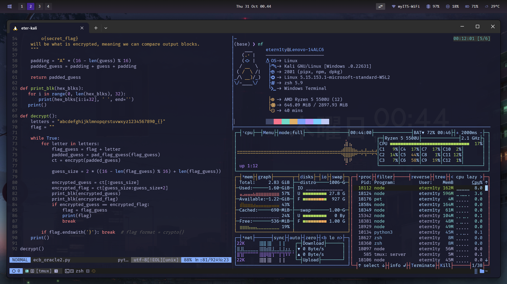

# Etern1ty's WSL kali-linux Setup

Mainly consists of **Tokyo Night** color schemes/theming. Currently running:

- zshrc
- vimrc
- tmux
- Windows Terminal
- GlazeWM w/ Zebar (defaults)

## Gallery

