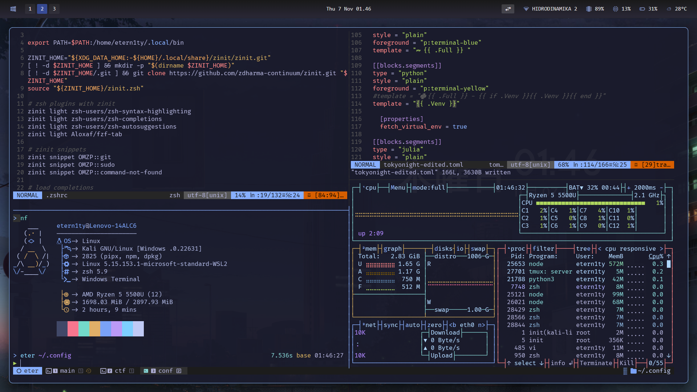

# Etern1ty's WSL kali-linux Setup

Mainly consists of **Tokyo Night** color schemes/theming. Currently running:

- zshrc
  - zinit - plugin manager
  - zoxide - better cd
  - eza - better ls
  - fzf
- oh-my-posh > [Tokyo Night (Edited)](https://github.com/JanDeDobbeleer/oh-my-posh/blob/main/themes/tokyonight_storm.omp.json)
- vimrc > [Tokyo Night](https://github.com/ghifarit53/tokyonight-vim)
- tmux > [Tokyo Night](https://github.com/janoamaral/tokyo-night-tmux)
- miniforge (for SageMath)
---------------------------------------

**NOTE** - Use `yadm` (yet another dotfiles manager) for ease of use/access

## Gallery

---------------------------------------

**Main Reference - [Winterbitia's WSL Setup](https://github.com/winterbitia/winterbitia-Kali-WSL/tree/main)**
